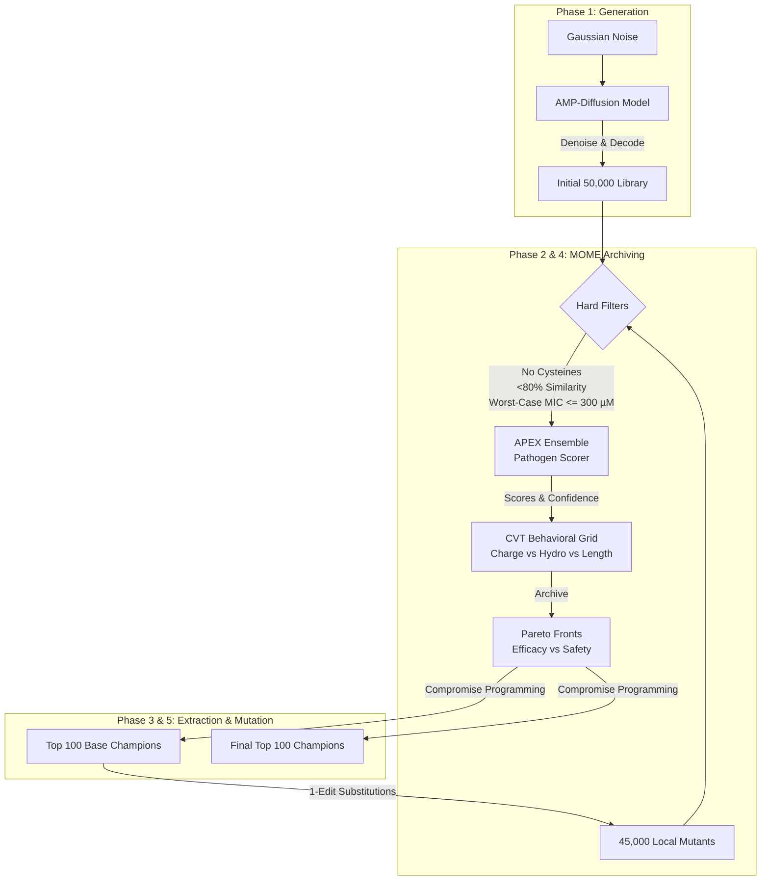

# AMP-Diffusion Starter Kit: AMP Challenge 2027 Baseline

A self-contained, reproducible generator that produces an optimized **AMP-Diffusion library** for the [AMP Challenge 2027](https://github.com/szczurek-lab/amp-challenge-2027).

This submission builds upon the latent-space diffusion model AMP-Diffusion (Torres et al., [*Cell Biomaterials* 2025](https://doi.org/10.1016/j.celbio.2025.100183)) by introducing a powerful **Multi-Objective MAP-Elites (MOME)** pipeline. We augment the generation with strict biophysical constraints, worst-case pathogen evaluation, and a 1-edit distance hill-climbing mutation phase to push candidates to their absolute Pareto-optimal limits.

## Abstract

AMP-Diffusion denoises Gaussian noise into ESM-2 embeddings and decodes them to linear amino acid sequences. While the original baseline utilized naive thresholding and random tie-breakers to select the top 100 candidates, our approach introduces a sophisticated evolutionary search. 

We evaluate every peptide against an 11-pathogen APEX ensemble, scoring them exclusively by their **worst-case Minimum Inhibitory Concentration (MIC)** to guarantee robust broad-spectrum activity against all strains, including MRSA and VRE. Candidates that pass strict hard filters (MIC ≤ 300 µM, Cysteine ban, <80% novelty) are clustered into a behavioral MAP-Elites grid (Charge vs. Hydrophobicity vs. Length). Inside each niche, we extract champions via a 2D Pareto front optimizing Worst-Case Efficacy against In-Vivo Stability (Instability Index).

Finally, we extract the top 100 champions, exhaustively generate all 1-edit distance single-residue substitutions (~45,000 variants), and pass them back through the MOME pipeline for a final round of hill-climbing to extract the globally optimal top 100 sequences.

## Architecture Overview

Our generative pipeline operates in three major phases: **Generation**, **Evaluation & Archiving**, and **Local Search (Hill-Climbing)**. 



## What this produces

Running the entry point automatically runs the full two-round pipeline and writes the output files under `generate_broad_spectrum/`:

```
generate_broad_spectrum/
  library.fasta   full 50,000-sequence library (Initial generation)
  mutants.fasta   45,000-sequence mutant pool (1-edit distance variants)
  top.fasta       top-100 ranked candidates (Final hill-climbed champions)
```

## Usage

This project is managed via `uv` and is fully self-contained. 

Requires `uv` and a **CUDA GPU** (the diffusion sampler and APEX ensemble are GPU workloads).

To run the complete end-to-end pipeline (Initial Generation $\rightarrow$ MOME Round 1 $\rightarrow$ Mutation $\rightarrow$ MOME Round 2):

```bash
uv run generate_broad_spectrum
```

To verify the submission against the challenge rules:
```bash
uv run python scripts/verify_submission.py . generate_broad_spectrum
```

## Folder Organization

```text
ampdiffusion-starter-kit/
├── checkpoint/
│   └── model.pt                # AMP-Diffusion trained weights (via Git LFS)
├── apex/
│   ├── APEX_pathogen_models/   # 8-Model APEX Ensemble weights (via Git LFS)
│   ├── APEX_predict.py         # Subprocess entry point for MIC prediction
│   └── README.md
├── data/
│   └── antibacterial.fasta     # Challenge reference database for novelty filters
├── scripts/
│   └── verify_submission.py    # Official challenge validation script
├── src/ampdiffusion_starter_kit/
│   ├── generate.py             # Main pipeline entry point (Wired for MOME & Mutation)
│   ├── model.py                # AMP-Diffusion neural architecture
│   ├── scoring.py              # APEX subprocess caller (Worst-case MIC integration)
│   ├── similarity.py           # Levenshtein distance calculations
│   └── mome/
│       ├── pipeline.py         # MOME orchestrator
│       ├── archive.py          # Pareto front archiving logic
│       ├── candidate.py        # Biophysical heuristic calculations
│       ├── cvt.py              # Behavioral clustering (Charge, Hydrophobicity, Length)
│       ├── extraction.py       # Compromise programming selection
│       └── filters.py          # Hard filters (Cysteine ban, MIC limits)
├── pyproject.toml              # uv dependency definitions
└── README.md                   # This document
```

## License

MIT (see [LICENSE](LICENSE)). AMP-Diffusion and APEX-pathogen are released by their respective
authors; see their repositories for terms.
